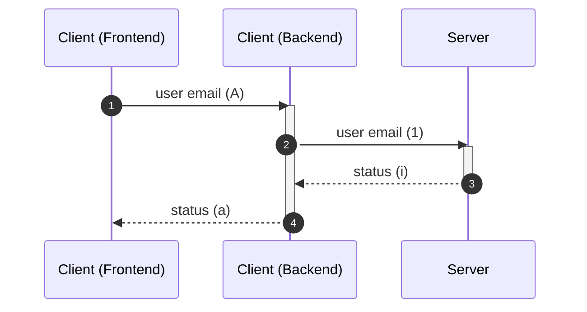
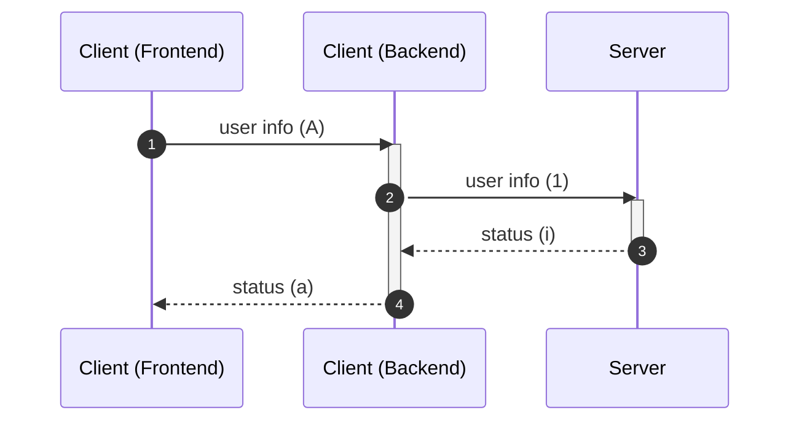
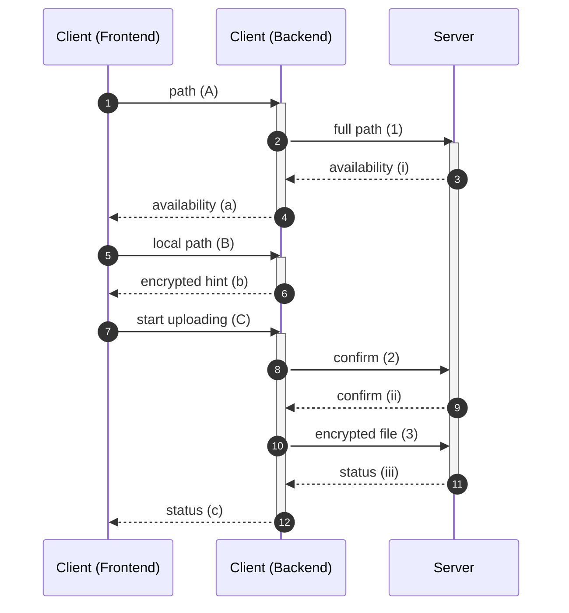
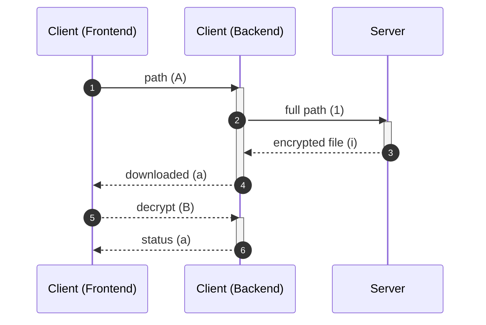

# C/S 通信接口规范

## 标准格式

所有数据都用 json 编码（除非特别标注）。

若一个流程中有一方报错或取消，整个流程终止。

## 建立信道

## 发送验证码



### Client (Backend)

#### (1)

```json
{
    "op": "gen-authcode",
    "email": "123@abc.com"
}
```

### Server

#### (i)

```json
{
    "status": 200
}
```

`status` 中 `200` 表示成功，`400` 表示失败。

## 密码登录


### Client (Backend)

#### (1)

```json
{
    "op": "pwd-login",
    "email": "123@abc.com",
    "pwd": "p@ssw0rd"
}
```

### Server

#### (i)

```json
{
    "status": 200
}
```

`status` 中 `200` 表示成功，`400` 表示失败。

## 验证码登录

**注意：执行此操作前必须已经获得验证码！**


### Client (Backend)

#### (1)

```json
{
    "op": "authcode-login",
    "email": "123@abc.com",
    "authcode": "1A2B3C4D"
}
```

### Server

#### (i)

```json
{
    "status": 200
}
```

`status` 中 `200` 表示成功，`400` 表示失败。

## 更新密码

**注意：执行此操作前必须已经获得验证码！**


### Client (Backend)

#### (1)

```json
{
    "op": "update-pwd",
    "email": "123@abc.com",
    "pwd": "P@SSW0RD",
    "authcode": "1A2B3C4D"
}
```

### Server

#### (i)

```json
{
    "status": 200
}
```

`status` 中 `200` 表示成功，`400` 表示失败。

## 注册

**注意：执行此操作前必须已经获得验证码！**



### Client (Backend)

#### (1)

```json
{
    "op": "register",
    "email": "123@abc.com",
    "pwd": "P@SSW0RD",
    "authcode": "1A2B3C4D"
}
```

### Server

#### (i)

```json
{
    "status": 200
}
```

`status` 中 `200` 表示成功，`400` 表示失败。

## 获取文件列表

**注意：执行此操作前必须已经登录！**


### Client (Backend)

#### (1)

```json
{
    "op": "get-dir-list",
    "id": "1a2b3c4d5a6b7c8d9a0b3c4d1a2b3c4d",
    "path": "./folder/subfolder"
}
```

`id` 是用户的邮箱（私人空间）或群组 ID（群组空间）。

### Server

#### (i)

```json
{
    "status": 200,
    "list": [
        {
            'name': 'storage',
            'type': 'dir',
            'size': None,
            'time': 1693707480
        },
        {
            'name': 'README.md',
            'type': 'file',
            'size': 14,
            'time': 1693567086
        }
    ]
}
```

`status` 中 `200` 表示成功，`400` 表示失败。

`type` 中 `“dir”` 表示目录，`“file”` 表示文件。

目录不显示大小，文件才显示大小，单位为字节。

上次修改时间为标准时间戳格式。

## 上传加密文件

**注意：执行此操作前必须已经登录！**



### Client (Backend)

#### (1)

```json
{
    "op": "put-file",
    "id": "1a2b3c4d5a6b7c8d9a0b3c4d1a2b3c4d",
    "path": "./folder/subfolder/file.txt"
}
```

`id` 是用户的邮箱（私人空间）或群组 ID（群组空间）。

#### (2)

```
200
```

直接发送信息，不编码 json，200 确认上传，400 取消上传。

#### (3)

直接发送二进制加密信息，不编码 json。

### Server

#### (i)

```
200
```

直接发送信息，不编码 json，200 可用，400 不可用。

#### (ii)

```
200
```

直接发送信息，不编码 json，200 可用，400 不可用。

#### (iii)

```json
{
    "status": 200
}
```

`status` 中 `200` 表示成功，`400` 表示失败。

## 新建目录

**注意：执行此操作前必须已经登录！**


### Client (Backend)

#### (1)

```json
{
    "op": "create-dir",
    "id": "1a2b3c4d5a6b7c8d9a0b3c4d1a2b3c4d",
    "path": "./folder/subfolder/subsubfolder"
}
```

`id` 是用户的邮箱（私人空间）或群组 ID（群组空间）。

### Server

#### (i)

```json
{
    "status": 200
}
```

`status` 中 `200` 表示成功，`400` 表示失败。

## 删除路径

**注意：执行此操作前必须已经登录！**


### Client (Backend)

#### (1)

```json
{
    "op": "del-dir",
    "id": "1a2b3c4d5a6b7c8d9a0b3c4d1a2b3c4d",
    "path": "./folder/"
}
```

`id` 是用户的邮箱（私人空间）或群组 ID（群组空间）。

### Server

#### (i)

```json
{
    "status": 200
}
```

`status` 中 `200` 表示成功，`400` 表示失败。

## 下载加密文件

**注意：执行此操作前必须已经登录！**



### Client (Backend)

#### (1)

```json
{
    "op": "get-file",
    "id": "1a2b3c4d5a6b7c8d9a0b3c4d1a2b3c4d",
    "path": "./folder/test.txt"
}
```

`id` 是用户的邮箱（私人空间）或群组 ID（群组空间）。

### Server

#### (i)

直接发送二进制加密信息，不编码 json。失败发送 `'\0'`。

## 新建/加入群组

**注意：执行此操作前必须已经登录！**


### Client (Backend)

#### (1)

```json
{
    "op": "join-group",
    "id": "1a2b3c4d5a6b7c8d9a0b3c4d1a2b3c4d"
}
```

### Server

#### (i)

```json
{
    "status": 200
}
```

`status` 中 `200` 表示成功，`400` 表示失败。